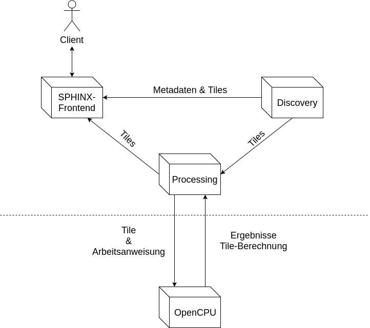

# Das Projekt

Ziel des Seminars Geosoftware II 2017/18 war die Entwicklung einer Anwendung, welche das Suche und Analysieren von Sentinel 2 – Aufnahmen mittels des Browsers ermöglicht.
Bisher gestaltete sich der Arbeitsablauf für die Verarbeitung von Sentinel 2 – Daten wie folgt:

  - Suche und Download der Daten über ein Portal
  - Öffne der Daten in einem neuen Programm für deren Analyse
  
Dieser Ablauf weißt mehre Schwächen auf. Der Download der Daten kann sehr viel Zeit in Anspruch nehmen, da die Daten mehrere GB groß sein können. Des Weiteren ist die Installation eines Programms zur Analyse der Daten eine weitere Hürde. Technische Probleme, wie z.B. Inkompatibilität zwischen OS-Architektur und dem Programm, sowie die Einarbeitung in ein ggf. komplexes Programm, sind als Beispiele zu nennen. Diese Aspekte limitieren den Einsatz von Sentinel 2 – Aufnahmen erheblich. Ein unkomplizierter Einsatz in Schulen, oder auch dem Katastrophenschutz, sind nicht gegeben.
Die Gruppe AMUN, bestehend aus (Christoph Friedrich, Gözde Can, Niklas Trzaska, Philipp Glahe, Philipp Pfeiffer) entwickelten im Rahmen des Seminars ein System (SPHINX), welches über einen Browser eine performante Suche und Analyse von Sentinel 2 – Daten ermöglicht. Das Herunterladen großer Datenmengen und die Installation von Spezieller Software zur Analyse der Daten entfällt. 

## SPHINX

*SHINX* ist eine, auf der Microservice Architektur basierende, Anwendung, mit welcher Sentinel 2 - Aufnahmen im Browser gesucht und analysiert werden können.

Dieses Dokument beschreibt die Architektur des Gesamtsystems, sowie die unterstützten Funktionalitäten. 
### Architektur
SPHINX ist eine Komposition aus 4 Servern. 3 Server (Discovery, Processing und SPHINX-Frontend) sind Eigenentwicklungen. OpenCPU ist ein Dienst Dritter. 

#### Die Komponenten
Im Folgenden werden die selber entwicklenten Komponenten kurz vorgestellt. 
Eine aussührliche Beschreibung, sowie die jeweiligen Installationsanleitungen der Dienste, können den Service-spezifischen Dokumentationen zu entnehmen.
##### Discovery
Dieser Dienst dient der Bereitstellung von Metadaten und Tiles zuSentinel 2 - Aufnahmen.
Eine detaillierte Dokumentation des Servers kann unter der folgenden URL eingesehen werden:
[https://amun-software.github.io/Geosoft2DiscoveryService/](https://amun-software.github.io/Geosoft2DiscoveryService/)

#### Processing

#### SHINX-Frontend
